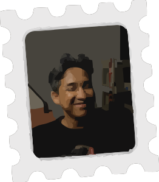

# Hi 👋, I'm Ruhul Ikram

### A passionate Blade developer

 
   

- ⚡ Fun fact **I Love AI**

- 👨‍💻 All of my projects are available at **[https://ruhulikram.github.io/](https://ruhulikram.github.io/)**

<h3 align="left">Connect with me:</h3>

<h3 align="left">Languages and Tools:</h3>

             

  

## 🤝 Support Me

  
  
If my work helps you or you just like the energy here, a star, follow, or friendly message is always appreciated.

